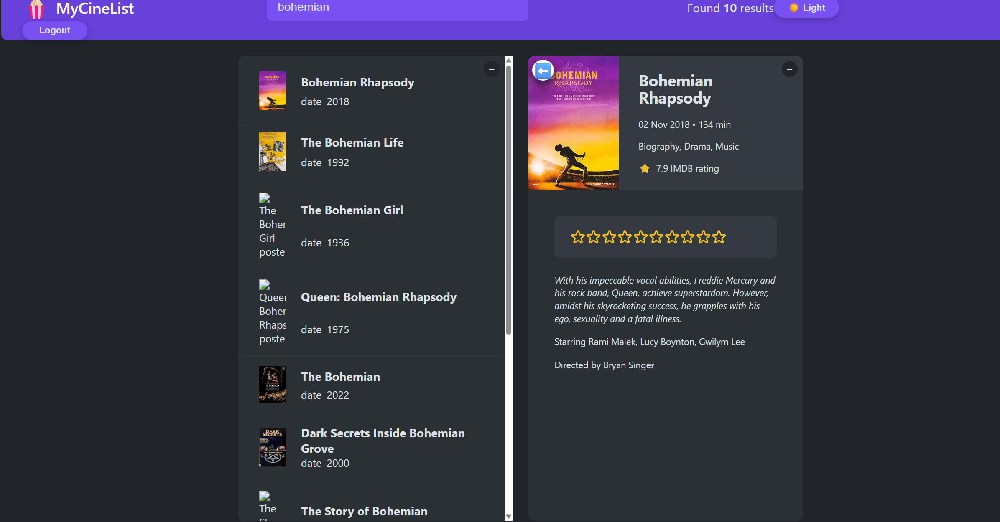

# 🎬 CineList

CineList is a full-stack web application that allows users to discover movies, create an account, save favorite movies, and rate them.  
The app includes authentication and persistent user-specific data.

This project was built to practice real-world full-stack development, including authentication, API integration, and frontend–backend communication.

---

## ✨ Features

- User registration and login (JWT authentication)
- Secure protected routes
- Browse and search movies using an external movie API
- Save watched movies per user
- Rate movies and update ratings
- Persistent user data stored in the database
- Responsive UI (desktop & mobile)
- Loading and error states handling

---

## 🛠️ Tech Stack

### Frontend
- React
- JavaScript (ES6+)
- CSS / CSS Modules / Tailwind CSS
- Fetch API / Axios

### Backend
- Node.js
- Express.js
- JWT authentication
- MongoDB & Mongoose
- REST API

### Other
- Git & GitHub
- Environment variables
- Deployment (Vercel / Netlify / Render)

---

## 🔐 Authentication Flow

- Users can register and log in
- On successful login, a JWT token is issued
- The token is stored on the client
- Protected requests send the token in the Authorization header
- Backend middleware validates the token
- User-specific data (watched and ratings) is tied to the authenticated user

---

## 📸 Screenshots

### Login

### Home

### Rating

### Watched

---
## 🚀 Live Demo

- Frontend: (https://cine-list-six-delta.vercel.app/login)
- Backend API: (https://mycinelist-00b6.onrender.com/api)
- Backend repository: (https://github.com/anka131/MyCineList)

---

## 🧠 What I Learned

- Implementing JWT authentication in a full-stack application
- Protecting backend routes using middleware
- Managing user-specific data (favorites and ratings)
- Connecting frontend and backend using REST APIs
- Handling loading and error states in React

---

## 🔮 Possible Improvements

- Add TypeScript
- Add unit and integration tests
- Implement movie recommendations
- Improve accessibility

## 👤 Author

Anka Knežević

Junior Frontend / Full-Stack Developer

GitHub: https://github.com/anka131
